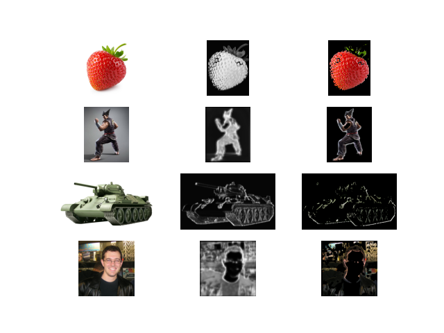

# Weryfikacja wytrenowanego modelu do wykrywania tła w zdjęciach.

##  Przygotowane przez: Patryk Michalak

### 
### - Model bazowany na AutoEncoderze
### - Zestaw danych trenujących - Coco Detection Dataset (https://www.kaggle.com/datasets/sabahesaraki/2017-2017)
### - Wszytkie potrzebne wersje bibliotek są zawarte w 'requirements.txt'

Model był trenowany na ograniczonym zbiorze danych ze względu na całkowity rozmiar danych. Wytrenowany model był trenowany na 200 zdjęciach przez 10 epok.

Zdjęcia testowe były wybrane przez testującego.

- Obraz #1 - Model w dopuszalny sposób wykrywa objekt na zdjęciu
- Obraz #2 - Model przeważnie dobrze przygotował maskę oprócz lewego bicepsu
- Obraz #2 - Model tylko prawidłowo wykrył krawędzie pojazdu, zostawiając środek pusty.
- Obraz #4 - Model tylko wyłacznie wyciął twarz i pojedyńcze kawałki tła

Wnioski - Model całkiem przyzwoicie sobie radzi jak tło jest jednolitego koluru który nie powtarza się w obiektcie